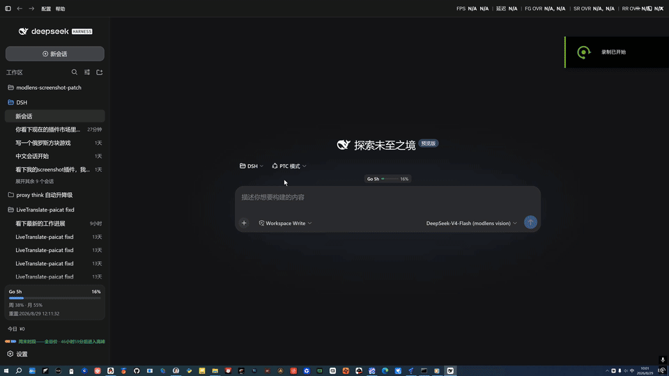
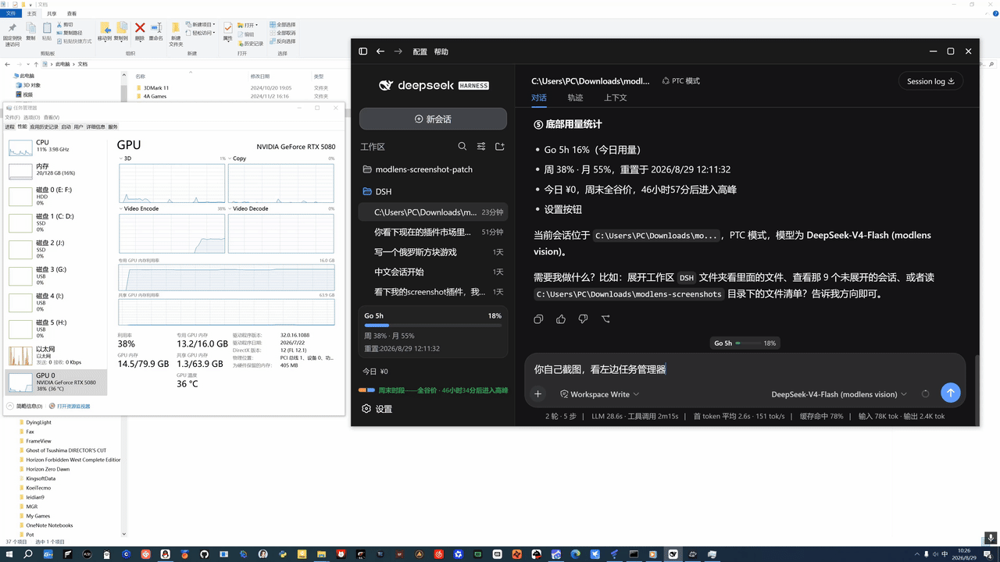

# dsh-screenshot

[English](README.en.md) | [中文](README.md)

**Zero-dependency screen capture for DeepSeek Harness**: **Lightweight**: zero deps, zero binaries; **Stage & shoot**: one-click full screen, window layout, hover-snap capture of occluded windows; **Agent self-service**: path-only delivery; paths are universal, pair with modlens (optional) for one-call structured evidence.

- **Lightweight** — pure PowerShell, zero dependencies, zero binary payload; capture is maintained independently and never breaks on upstream updates.
- **Stage & shoot** — one-hotkey full-screen capture, or keep the desktop live and arrange *any* window before box-selecting a region; **hover any window and it glows with a snap outline — one click captures that window's full content, even when occluded** (except legacy console windows, see below) — what you stage is what you get.
- **Agent self-service** — the model can capture the screen on its own; with modlens (optional) installed, capture + read happen in one call, returning structured content (OCR/layout/semantics) that text-only models can consume directly.

## Quick start

```sh
dsh plugin --profile web add @paicat1/dsh-screenshot
# restart dsh web
```

- `Ctrl+Alt+S` — capture: once armed, **click the desktop = full screen**; **hover a window = snap outline, one click captures that window's full content (even when occluded, except legacy console windows)**; **drag = free region** (Esc to cancel)
- `Ctrl+Shift+Alt+S` — full-screen capture: no interaction, captures the whole virtual desktop
- Want the agent to screenshot on its own? Just tell it to use the `modlens_screenshot` tool.

Video tutorial (Bilibili): [Using DeepSeek Harness to build a Dsh screenshot plugin for DeepSeek Harness](https://www.bilibili.com/video/BV1bF8G6oE66/)

## Two doors: hotkey for humans, tool for agents

| Entry | Best for | Notes |
|---|---|---|
| Browser hotkey (human) | "Here's the screen I want to show you" | Full / region capture; the PNG path is auto-inserted into the DSH input box and copied to the clipboard |
| `modlens_screenshot` tool (agent) | "Let me look at the screen myself" | Model-invoked: capture + (with modlens present) in-call structured read, returning evidence + the shot path |

| Manual capture demo | Agent self-capture demo |
|---|---|
|  |  |

## Why pass the path, not the image?

Screenshots are saved to `%USERPROFILE%\Downloads\modlens-screenshots\` (a dedicated, easy-to-clean directory), and **only the PNG path is handed to the agent** — not the image stuffed into a chat box or temp directory. Deliberate design:

- **No image litter**: many agent frameworks copy pasted images into their own temp/attachment directories, accumulating untrackable junk. A path keeps the image in exactly one place (`modlens-screenshots/`); cleaning up is deleting one directory.
- **Paths are universal**: any image-capable agent (native multimodal models, or modlens-style bridges) can read an image from a path — paths are universal, image formats are not.
- **Clean context**: a path is tens of bytes of text; an image is hundreds of KB of binary. Paths keep the context clean and traceable.

Capture once, reuse the path in any agent, produce zero junk.

## Capability split: what's the plugin's, what's modlens's

| Layer | Capability | Owned by |
|---|---|---|
| Capture | Full / region / **window-snap capture** / staged-window layout, zero-dep PowerShell | This plugin |
| Delivery | Path-only, clipboard, dedicated save dir | This plugin |
| Entry points | Browser hotkeys + agent-callable capture tool | This plugin |
| Reading | OCR / layout / semantics structured evidence | modlens (optional) |
| Consumption | Who understands the image | any multimodal model / vision bridge — agnostic |

Capture and delivery are fully self-contained and work standalone; reading is an ecosystem combo — install modlens (or hand the path to any image-capable model/bridge) to unlock it. Without modlens, capture still works.

**Why can window-snap capture "occluded" windows?** On hover the plugin enumerates the on-screen windows and outlines the one under the cursor; on click it uses `PrintWindow` to ask the window to **render itself** — the shot is the window's own content, not the on-screen pixels, so being covered by other windows or wrapped in a DWM shadow doesn't matter. It then crops to the DWM content bounds to drop the shadow, for clean edges.

**Known exception: legacy console windows** (`ConsoleWindowClass`, rendered by the system conhost). This includes **cmd (Command Prompt), Windows PowerShell 5.1, a standalone PowerShell 7**, and any CLI program running in a traditional console (`python`, `node`, `git`, batch scripts, etc.) — **Windows Terminal is NOT one of them** (it has its own rendering engine). These windows **do not respond to `PrintWindow`**, and **do not render their GDI surface while covered** — both "see-through occlusion" paths are unavailable. Clicking such a window falls back to capturing the on-screen pixels of its region: clean and complete when unobstructed, but it will include whatever covers it when it's occluded (same behavior as Windows' built-in snipping tool). **To capture a console window cleanly, either bring it to the foreground (clearing anything over it) and click it, or just drag-select over it.**

## Configuration

Optional cordis config (all enabled by default):

- `route: false` — disable the browser capture route
- `tool: false` — disable the `modlens_screenshot` tool

`MODLENS_DSH_CLI` explicitly sets the modlens CLI path (default probe: `~/.dsh/profiles/{web,headless}/node_modules/@liustack/modlens/dist/main.js`).

## Platform & License

- **Platform**: Windows (relies on PowerShell `System.Drawing.CopyFromScreen`)
- **License**: MIT

## Relationship with modlens

| Layer | Depends on modlens? | Notes |
|---|---|---|
| Capture action | **No** | Pure PowerShell `CopyFromScreen`, zero dependencies |
| Browser hotkeys / path insert | **No** | Standalone route `/dsh-screenshot/screenshot` |
| `modlens_screenshot` tool reading | **Yes (optional)** | If the modlens CLI is missing, the tool is not registered; capture still works |
| Multimodal models | No | After the path is inserted, multimodal models (e.g. go-mimo) can read the image directly, no modlens needed |

## Background & credits

The capture capability was originally implemented as an enhancement to the dsh plugin of [@liustack/modlens](https://github.com/liustack/modlens) (by Leon Liu): the original modlens dsh plugin integrated capture (this repo's fork of the `feat/dsh-screenshot` branch), and the author marked it as not planned in [issue #48](https://github.com/liustack/modlens/issues/48). It was split into this standalone plugin to decouple capture from modlens updates.

**Many thanks to the original author for giving DSH image-reading ability** — modlens lets text-only models (DeepSeek/GLM) "see" images, and this plugin's `modlens_screenshot` tool reuses the modlens pipeline to combine "capture + read" into one step. The capture half is maintained separately, but the image-reading ability always belongs to the modlens project.
